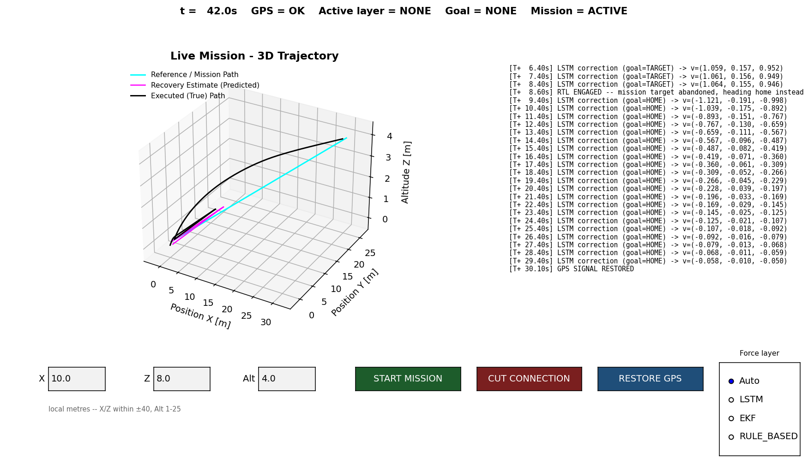

# Execution Guide - SD-UAV AI Recovery

All commands run from inside the `AI_Recovery/` folder.

---

## Prerequisites

| Tool | Version | Notes |
|------|---------|-------|
| Python | 3.10+ | `python --version` |
| Godot Engine | **4.x** | godotengine.org - use the Standard build, not .NET |
| pip packages | - | see Step 1 |

---

## Step 1 - Install Dependencies

```powershell
# Windows
pip install -r ai_backend\requirements.txt
```
```bash
# Linux / WSL
pip3 install -r ai_backend/requirements.txt
```

Installs: `torch`, `scikit-learn`, `joblib`, `stable-baselines3`, `gymnasium`, `pandas`, `numpy`, `matplotlib`.

---

## Step 2 - Train Models

> **Note:** production models in `ai_backend/models/` (`dr_lstm_imu_norm.pth` + scalers) are
> current as of this guide's last update - trained on the 14-feature pipeline, verified loading
> cleanly, and independently cross-validated between `train.py` and `ml_pipeline.py`'s own runs
> (see `TRAINING_ANALYSIS.md` Part 5). Retraining is optional unless you want to reproduce the
> numbers yourself or experiment with a different source/epoch count.

Two options:

### Option A - Run the full ML pipeline (recommended, generates all figures + results.json)
```powershell
python ai_backend\ml_pipeline.py
```

Takes **~12 min on CPU**. Breakdown:
- Steps 1–5 (audit, clean, normalize, features, sequences): ~30 s
- Run A (nav, no-norm, 10 epochs): ~3 s
- Run B (nav, norm, 10 epochs): ~3 s
- Run C (imu-only, norm, 10 epochs): **~5 min** (544K rows)
- Run D (nav+imu, norm, 10 epochs): **~5 min** (549K rows)
- Step 11 (RL eval): ~30 s

Outputs:
- `runs/figures/*.png` - 12 analysis charts
- `runs/models/*.pth` - 4 experiment models (A/B/C/D)
- `runs/results.json` - all numerical results (appended per run under `run_N` key, never overwritten)
- `runs/pipeline.log` - appended log with run number and timestamp
- `runs/run_counter.json` - total pipeline runs

> Pipeline overwrites all `.png`, `.pth`, and `results.json` on each run. Log and counter are appended/incremented.

### Option B - Train production models directly (faster)
```powershell
# imu-only, 20 epochs (~10 min on CPU) - the recommended default
python ai_backend\train.py --sources imu --epochs 20

# Real PX4 hardware flight logs (see datasets/px4_raw/SOURCE.md)
python ai_backend\train.py --sources px4 --epochs 20
```

> **`--sources nav` is deprecated (2026-07-23).** `uav_navigation_dataset.csv`'s position data was found to not be a real trajectory - a single timestep implies ~1000-2200m of movement while its own `speed` column reports 7-30 m/s, which is physically impossible. This isn't a coordinate-unit issue (degrees vs. metres); the underlying data has no real spatial continuity. Do not use `nav` for new work, and do not combine `imu`+`px4` either yet - their gyro units haven't been reconciled (see `datasets/px4_raw/SOURCE.md`). Full investigation: `AI_RECOVERY_EXECUTION_PLAN.md` §10-§11.

Each run saves:
- `ai_backend/models/dr_lstm_{tag}.pth` - model weights
- `ai_backend/models/scaler_X_{tag}.pkl` - input scaler (required for inference)
- `ai_backend/models/scaler_y_{tag}.pkl` - output scaler (required for inference)

---

## Step 3 - Train the RL Seek-Bias Policy (optional)

```powershell
python ai_backend\train_rl_recovery.py --total-timesteps 10000
```

Trains a PPO policy (`RecoveryPolicyEnv`, 10K steps) that can optionally replace
`recovery_orchestrator.py`'s hand-coded seek-bias formula -- not a separate hierarchy layer, an
alternative implementation of the existing seek term, consuming reconstructed position + EKF
confidence. Saves `ai_backend/models/ppo_recovery_seek.zip`. Opt-in at runtime
(`set_navigation_policy(True)` or `--rl-seek` on `live_mission_demo.py`/`udp_server.py`), off by
default. `python ai_backend\models\rl_path_recovery.py` on its own now only runs a quick smoke test
of the environment, no training.

To benchmark the hand-coded formula vs. the trained RL policy:
```powershell
python ai_backend\eval_metrics.py
```
Expected output (this checkpoint, this budget): hand-coded formula ~9.0% raw success vs. RL ~2.0% --
but RL's corrections are ~6-14x smaller on average and a controlled test confirms it genuinely
shrinks corrections under higher uncertainty, unlike the fixed formula. See
`AI_RECOVERY_EXECUTION_PLAN.md` §19.11 for the full honest result and why raw success rate isn't
the whole story here.

---

## Step 4 - Start the Python UDP Server

```powershell
python ai_backend\api\udp_server.py
```

Expected startup output (after Step 2):
```
[LSTM] Loaded model: dr_lstm_imu_norm.pth  (input_size=14)
UDP Server listening on 0.0.0.0:14551
UDP Server will send commands to 127.0.0.1:14552
```

**Keep this terminal open.** It receives drone telemetry on port 14551 and sends AI corrections back on port 14552.

If you see `WARNING: No model+scaler pair found`, run Step 2 first.

---

## Step 5 - Open the Godot Simulator

### What to import

1. Open **Godot 4.x** (the launcher / Project Manager)
2. Click **"Import"**
3. Navigate to:
   ```
   D:\SAR\latest\SAR-SIMULATION\AI_Recovery\simulation\project.godot
   ```
4. Click **"Import & Edit"**

> **Do NOT** open anything from `godot_integration/` - that folder contains a broken Godot 3 script and is not used.

### What you'll see in the editor

| File | Purpose |
|------|---------|
| `scenes/main.tscn` | The only scene - open this |
| `scripts/main.gd` | Spawns 3 drones, environment, camera (tracks `Drone_1`), trajectory visualizer |
| `scripts/drone_body.gd` | Per-drone flight controller + UDP telemetry sender + mission autopilot (`start_mission`) |
| `scripts/hud_layer.gd` | Full 2D HUD, including the Mission Control panel and Decision Terminal |
| `scripts/trajectory_visualizer.gd` | Live 3D rendering of the mission demo's reference/predicted/executed paths |
| `scripts/udp_bridge.gd` | Receives AI corrections from Python (port 14552) |
| `scripts/drone_state.gd` | Autoload singleton (player drone state) |
| `scripts/mission_log.gd` | Autoload singleton - event bus feeding the Decision Terminal panel |
| `scripts/serial_bridge.gd` | Autoload singleton - listens on UDP 14550 for real-hardware serial telemetry and flips `DroneState.mode` to `"SERIAL"` when a packet arrives; stays silent in SIM mode otherwise |

`serial_bridge.gd` is registered as an autoload (`SerialBridge`) in `project.godot` and runs at all times, but it is only relevant for real-hardware SERIAL mode, not the SIM-mode UDP path (`udp_bridge.gd`, ports 14551/14552) used in this walkthrough.

### Run the simulation

1. Make sure the Python UDP server (Step 4) is still running
2. Press **F5** (Play) in Godot

### What to observe - hands-on, not automatic

There is no timer anymore. GPS loss is triggered on demand from the HUD's **Mission Control**
panel, which drives `Drone_1` (also the default camera target):

| Step | Action | What happens |
|------|--------|---------------|
| 0 s | 3 drones spawn: `Drone_0` (player, WASD/gamepad, not camera-tracked by default), `Drone_1` (**mission demo drone**, camera-tracked), `Drone_2` (plain autonomous hover) | All 3 send telemetry to Python at 10 Hz - check the Python terminal for data |
| - | Enter a target in Mission Control (local metres, X/Z within ±40, Alt 1-25) and press **START MISSION** | `Drone_1` flies there using its true position (GPS still live) |
| - | Press **CUT CONNECTION** | `gps_signal` flips false on `Drone_1`; mission autopilot suspends itself immediately (it does not keep secretly using ground truth) |
| - | Python terminal prints `[Drone_1] GPS LOST -> layer=... goal=... v=[...]` | `recovery_orchestrator.py` picks LSTM (once its buffer is warm) or EKF, pulling toward the mission target (`goal=TARGET`) |
| ~8 s of continuous loss | If the target still isn't close, the orchestrator aborts the mission and switches to `goal=HOME` | The Decision Terminal panel logs a one-time `RTL ENGAGED` line; the correction visibly reverses direction, heading back to `Drone_1`'s launch point instead |
| any time | Press **RESTORE GPS** | GPS returns; the mission autopilot resumes if it hadn't finished |
| any time | Stop the Python server entirely (Ctrl+C) while GPS is still lost | No more AI corrections arrive; after 500ms, `breadcrumb_recovery.gd` (pure GDScript, no Python dependency at all) takes over and replays the flown path in reverse - a genuine total-link-loss test, not simulated |

A no-Godot equivalent of this whole workflow - same orchestrator, same behavior, a live
matplotlib window instead of the 3D view - is `ai_backend/live_mission_demo.py`:

```powershell
python ai_backend\live_mission_demo.py                    # interactive window
python ai_backend\live_mission_demo.py --headless-test     # scripted run, saves a PNG, no display needed
```



*(target-then-RTL in action - LSTM pulls toward the mission target, then after 8s of continuous
GPS loss without getting close, aborts and heads home instead: the correction flips sign at
`RTL ENGAGED` and the predicted path curves back on itself. Same underlying behavior applies to
the Godot side above.)*

---

## Project File Structure

```
AI_Recovery/
├── ai_backend/
│   ├── api/
│   │   ├── udp_server.py          ← Start this first (Step 4) - thin UDP wrapper
│   │   └── recovery_orchestrator.py ← The live LSTM→EKF→rule-based(+seek+RTL) decision logic;
│   │                                  also runnable standalone: python recovery_orchestrator.py
│   ├── data_processing/
│   │   └── dataset_parser.py      ← IMU/nav/px4 data loading + normalization (14 features)
│   ├── models/
│   │   ├── dead_reckoning_model.py ← LSTM architecture (input_size=14)
│   │   ├── ekf_baseline.py        ← Classical EKF - offline baseline AND live recovery layer
│   │   ├── ssl_pretext.py         ← Self-supervised pretraining (masked reconstruction)
│   │   ├── rl_path_recovery.py    ← RecoveryPolicyEnv (RL seek-bias policy, wired in, opt-in)
│   │   ├── dr_lstm_imu_norm.pth   ← Current production model (14-feature)
│   │   ├── scaler_X/y_imu_norm.pkl ← Matching scalers
│   │   └── ppo_recovery_seek.zip  ← Trained RL seek-bias policy (train_rl_recovery.py)
│   ├── train.py                   ← Train LSTM (saves model + scalers)
│   ├── train_rl_recovery.py       ← Train the RL seek-bias policy (saves ppo_recovery_seek.zip)
│   ├── evaluate_trajectory.py     ← Offline chained real-trajectory evaluation
│   ├── live_mission_demo.py       ← Standalone Python hands-on demo, no Godot needed
│   ├── eval_metrics.py            ← Rule-Based vs RL benchmark
│   ├── ml_pipeline.py             ← Full 12-step pipeline with figures
│   └── requirements.txt
├── datasets/
│   ├── uav_navigation_dataset.csv  ← DEPRECATED - not a real trajectory, see plan §10
│   ├── imu_data.csv                ← 544,763 rows, full IMU suite - primary training source
│   └── px4_raw/*.ulg               ← Real PX4 hardware flight logs, see SOURCE.md
├── runs/
│   ├── figures/                   ← ML pipeline charts (12 × *.png, overwritten per run)
│   ├── figures_single_drone/      ← Real chained-trajectory + training-curve figures
│   ├── models/                    ← Pipeline experiment models (A/B/C/D)
│   ├── results.json               ← All training results (appended per run under run_N)
│   ├── pipeline.log               ← Appended output of every pipeline run
│   └── run_counter.json           ← {"count": N, "last_run": "ISO timestamp"}
├── screenshots/
│   └── live_mission_demo.png      ← Reference screenshot, see ai_backend/README.md
├── simulation/                    ← Import THIS folder into Godot 4
│   ├── project.godot              ← Open this file in Godot
│   ├── scenes/main.tscn
│   └── scripts/
│       ├── main.gd
│       ├── drone_body.gd
│       ├── hud_layer.gd           ← Mission Control panel + Decision Terminal
│       ├── trajectory_visualizer.gd
│       ├── mission_log.gd
│       ├── breadcrumb_recovery.gd
│       ├── udp_bridge.gd
│       ├── camera_controller.gd
│       └── drone_state.gd
├── STATUS.md                      ← Project status + roadmap
├── AI_RECOVERY_EXECUTION_PLAN.md  ← The authoritative, running narrative log (§1-§18+)
├── TRAINING_ANALYSIS.md           ← Deep technical analysis of all training runs
├── analysis.md                    ← Per-graph ML analysis (Bias-Variance, normalization, LSTM theory)
├── generate_analysis_report.py    ← Generates runs/analysis_report.html with all figures embedded
└── EXECUTION_GUIDE.md             ← This file
```

---

## Quick Reference

```powershell
# Full demo (from AI_Recovery/)

# Terminal 1 - Python AI server (production model already trained, see Step 2)
python ai_backend\api\udp_server.py

# Terminal 2 - verify the live recovery logic headlessly, no Godot/network at all
python ai_backend\api\recovery_orchestrator.py

# Terminal 2 (alt) - hands-on demo without Godot
python ai_backend\live_mission_demo.py

# Terminal 2 - (optional) run ML pipeline to regenerate all figures
python ai_backend\ml_pipeline.py

# Terminal 2 - (optional) regenerate HTML analysis report after pipeline run
python generate_analysis_report.py
# Opens: runs/analysis_report.html  (self-contained, no server needed)

# Godot - open simulation\project.godot → F5, then use the Mission Control HUD panel
```

```bash
# Linux equivalent
python3 ai_backend/api/udp_server.py
python3 ai_backend/live_mission_demo.py
python3 ai_backend/ml_pipeline.py
```

## Feature Reference (14 inputs to LSTM)

| Feature | Description | Unit |
|---------|-------------|------|
| `imu_acc_x/y/z` | Linear acceleration, body frame X/Y/Z | m/s² |
| `imu_gyro_x/y/z` | Angular velocity, body frame X/Y/Z | rad/s |
| `roll` | Rotation around X-axis (from IMU; 0 for nav) | degrees |
| `pitch` | Rotation around Y-axis (from IMU; 0 for nav) | degrees |
| `yaw` | Rotation around Z-axis / heading (from IMU; 0 for nav) | degrees |
| `mag_x/y/z` | Magnetometer / compass readings (from IMU; 0 for nav) | normalized |
| `speed` | Scalar ground speed = `√(Δlat²+Δlon²+Δalt²)/dt` | m/s |
| `dt` | Time since last sample | seconds |
