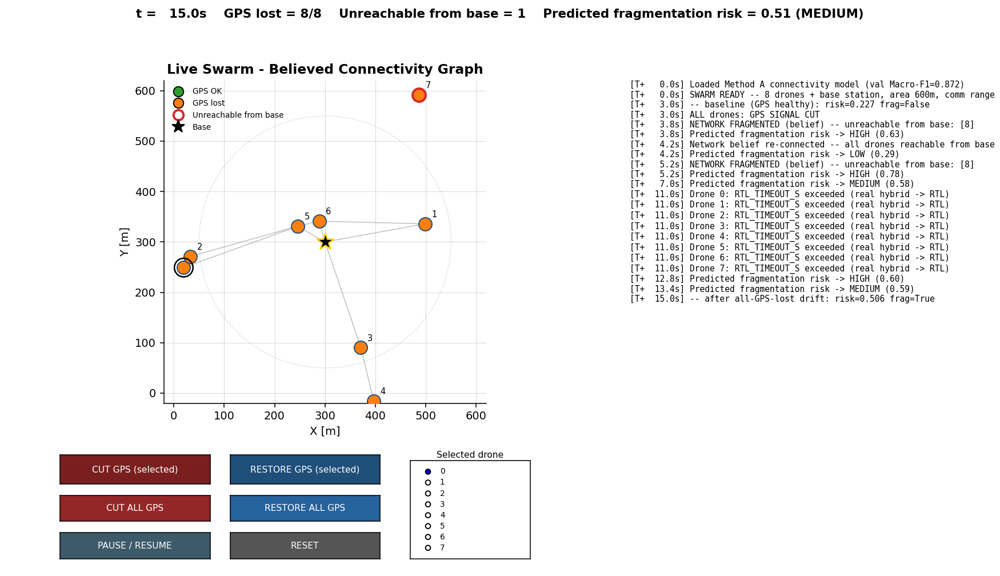

# SD-UAV AI Recovery - Project Status & Roadmap

> **This file is the at-a-glance dashboard.** For the full narrative - every bug found, every
> design decision, why things are the way they are - see **[AI_RECOVERY_EXECUTION_PLAN.md](AI_RECOVERY_EXECUTION_PLAN.md)**
> (§1-§19+, the authoritative, continuously-maintained log). This file summarizes its current
> state; if the two ever disagree, the execution plan wins.

## 1. Executive Summary

| Field | Value |
|-------|-------|
| **Current status** | Working single-drone prototype with a genuinely live, hands-on fail-safe hierarchy -- not just an offline pipeline -- now backed by a formal, multi-seed, 6-architecture ablation study (§19) rather than a single LSTM-vs-EKF comparison. Both a Godot 3D simulation and a standalone Python tool demonstrate mission flight → GPS-loss recovery → (if needed) return-to-home, driven by one shared, headlessly-tested decision engine, with a live picker to compare any of the 6 trained architectures against each other. |
| **Production model** | `ai_backend/models/dr_lstm_imu_norm.pth` -- as of the Track A ablation study (§19.7), this is now seed 4 from the 5-seed ablation run, promoted after beating the original checkpoint on a fresh chained-trajectory evaluation (24.78 m vs. 26.34 m). The outgoing checkpoint is preserved, not deleted (`dr_lstm_imu_norm_pre_seed4_continuation.pth`). |
| **Best-known architecture (not yet production)** | The ablation study (§19.6) found the Transformer statistically beats the LSTM, RandomForest, and both SSL variants on chained-trajectory error (9.10 m mean at 5 seeds vs. the LSTM's 29.68 m) -- but is also, by a wide margin, the *least consistent* model seed-to-seed (71% relative variability vs. RandomForest's 2%). Selectable live via the new model picker (below); not promoted to the default production checkpoint, since "best on average, least predictable per run" is a real tradeoff, not yet resolved. |
| **A striking single-run result that didn't survive confirmation** | Retraining the Transformer without augmentation (§19.10) gave 6.47 m final on one run -- nearly half the with-augmentation result. Confirmed with the same 5 seeds `cpu_5seeds` uses: mean **10.28 m, 95% CI [6.05, 14.52] m**, heavily overlapping the real Transformer's 9.10 m, CI [2.61, 15.60] m. Not a real improvement, nominally slightly worse on the mean -- the single-run number was seed luck. The same confirmation on the order-shuffle finding (9.78 m single-run) landed the same way: mean 10.01 m, CI [2.39, 17.64] m, also indistinguishable from the real Transformer. Neither intervention moves the needle once tested properly; only the ensemble mitigation (above) held up. |
| **Trustworthy baseline numbers** | Real chained-trajectory error, current production LSTM: **24.78 m** final. Full 6-architecture, 8-method comparison (chained, 5-seed 95% CI): see `runs/ablation/cpu_5seeds/ANALYSIS.md`. **For the full cross-project "what's the best model/result" synthesis, see [`FINAL_RESULTS_ANALYSIS.md`](FINAL_RESULTS_ANALYSIS.md).** |
| **What's genuinely new and live** | `ai_backend/api/recovery_orchestrator.py` -- LSTM → EKF → rule-based selection, a seek-bias toward the mission target (now optionally a trained PPO policy instead of the hand-coded formula, `set_navigation_policy()`/`--rl-seek`, §19.11), a target-then-RTL hybrid, **and a live model picker** (any of the 6 ablation-study architectures, `--model` flag or `live_mission_demo.py`'s radio buttons) plus Pause/Resume/Reset/End Mission controls and a mission-relative timer. Live in both the Godot HUD (Mission Control panel) and a Godot-free `ai_backend/live_mission_demo.py`. |
| **Not yet done** | A **Godot-integrated** live multi-drone swarm (real UDP multi-node protocol): Track B's own live demo (below) is a self-contained Python simulation, not wired into the Godot scene; imu/px4 gyro-unit reconciliation (investigated, genuinely irreconcilable -- §19.1, not a to-do anymore, a documented limitation); more diverse training data *for `imu_data.csv` specifically* (the Transformer's actual production training source) -- the analogous experiment (§19.12) was run on the separate, standalone PX4 corpus instead (the two datasets can't be combined, see above), with a promising-but-not-yet-statistically-confirmed result; there's still no path to new diverse `imu_data.csv` recordings without Godot access. RL wiring (§19.11), the PX4 diversity thread (§19.12), and the swarm-connectivity Track B (§20) are all now done, see §3-§4 and execution plan §19.11-§20. |

---

## Architecture Overview

```text
                     Godot 4 Simulation  <--UDP 14551/14552-->  Python AI Backend
                     ───────────────────                        ─────────────────
  Drone_0 (player)                                    udp_server.py (thin UDP wrapper)
  Drone_1 (mission demo drone, camera-tracked)  ──►         │
    - Mission Control HUD panel                              ▼
      (target X/Z/Alt, START/CUT/RESTORE, Force Layer)  recovery_orchestrator.py
    - Decision Terminal HUD panel (mission_log.gd)       ─────────────────────────
    - trajectory_visualizer.gd (cyan/magenta/black)      RecoveryOrchestrator.decide():
  Drone_2 (plain autonomous hover)                          1. LSTM  (dead_reckoning_model.py)
                                                              2. EKF   (ekf_baseline.py)
  breadcrumb_recovery.gd (Godot-only,                        3. rule-based (+ seek-bias,
    zero-AI, survives total Python/link loss)                   target-then-RTL hybrid)
```

**Fail-safe hierarchy** (degrade toward simplicity - confirmed design direction): Mission
autopilot (true GPS) → LSTM → EKF → rule-based → breadcrumb. RL is not a separate tier -- it's an
optional, opt-in replacement for the hand-coded seek-bias term *inside* the LSTM/EKF layers
(`set_navigation_policy(True)` / `--rl-seek`, default off), consuming the hierarchy's own
reconstructed position + EKF confidence rather than raw GPS. Wired in and tested, §19.11; honest
result there too -- see §3.

**Live GPS-loss flow** (both front ends, same orchestrator):

1. GPS lost → mission autopilot suspends itself immediately (never keeps using ground truth).
2. `recovery_orchestrator.py::decide()` picks LSTM (buffer warm) or EKF, and blends in a
   distance-proportional, capped pull toward the current goal (`SEEK_KP`, `SEEK_MAX_CONTRIB`, or a
   trained PPO policy in its place if `set_navigation_policy(True)` was called).
3. Goal starts at the mission target (`goal="TARGET"`); after `RTL_TIMEOUT_S` (8s) of continuous
   loss without closing to within `RTL_SKIP_IF_CLOSE_M` (3m), it switches - sticky - to the
   drone's launch/home position (`goal="HOME"`), logged as a one-time `RTL ENGAGED` event.
4. If corrections stop arriving entirely (Python down, or link dead) for >500ms, breadcrumb takes
   over independently - no Python dependency at all.

---

## 2. Data Integrity - Three Bugs Found, and a Fourth Finding

Every number in this project was, at some point, wrong because of one of these - full root-cause
narrative in the execution plan §6-§11:

1. **Sequence-shuffle leakage** - overlapping training windows were shuffled before the train/val
   split. Fixed: strict temporal-order split.
2. **Scaler fit-before-split leakage** - `StandardScaler` was fit on the full dataset, not just
   the training slice. Fixed: fit train-only, transform val.
3. **Domain-shift scaler contamination** - combining GPS-degree and relative-metre position
   sources without unit conversion corrupted the shared scaler. Fixed: per-source deltas +
   `_src_id` boundary-aware windowing + a standing `verify_unit_consistency()` guard that now
   blocks any future source combination whose per-column scale differs by >3× unreconciled.
4. **`uav_navigation_dataset.csv` ("nav") is not a real trajectory** - physically impossible
   (implies ~1000-2200 m/s movement while its own `speed` column says 7-30 m/s). Deprecated
   permanently, not just unit-fixed. Replaced as the second data source by real PX4 public
   hardware flight logs (`datasets/px4_raw/*.ulg`, see `SOURCE.md`) - not yet combinable with
   `imu_data.csv` (gyro units unreconciled, `verify_unit_consistency()` correctly blocks it).

**Only `imu_data.csv` (Run C, imu-only) is a trustworthy training source today.** `nav` is kept
loadable only to reproduce the historical negative result.

---

## 3. Completed Features

### Data pipeline (`ai_backend/data_processing/`)

- [x] Leakage-safe, unit-verified, source-boundary-aware sequence building (`dataset_parser.py`).
- [x] Real PX4 flight-log ingestion (`download_px4_logs.py`, `load_and_clean_px4_data()`).
- [x] `flight_recorder.py` - records live Godot telemetry to CSV for future dataset growth.

### Models (`ai_backend/models/`)

- [x] `DeadReckoningLSTM` (14 features, hidden=64, layers=2) - production model current.
- [x] `MaskedLSTMAutoencoder` (`ssl_pretext.py`) - self-supervised pretraining. **Honest negative
      result**: pretraining converges cleanly on its own terms (val 0.157) but fine-tuning from it
      (val 0.810) is worse than from-scratch supervised (val 0.719) - reported as-is.
- [x] `DeadReckoningEKF` (`ekf_baseline.py`) - classical strapdown Kalman filter, verified via
      smoke test, **live** as the second layer of the recovery hierarchy (not just an offline
      baseline).
- [x] `rl_path_recovery.py` (`RecoveryPolicyEnv`, PPO) - **wired into the live hierarchy** (§19.11).
      State is the reconstructed position + EKF confidence (not raw coordinates), truth-vs-belief
      reward design so the policy must learn to discount its own noisy observation. Honest 10K-step
      result: 2.0% raw arrival success vs. the hand-coded formula's 9.0%, but a real, isolated
      confidence-shrinking behavior confirmed in a controlled test -- mechanism proven, not yet
      dominant at this training budget. Opt-in (`set_navigation_policy()` / `--rl-seek`), off by
      default.

### Evaluation (`ai_backend/`)

- [x] `evaluate_trajectory.py` - real chained-trajectory reconstruction (not just windowed MSE)
      against a held-out 12.5s segment: **LSTM 26.3m final error vs. EKF 132.5m vs. pure-inertial
      143.0m.** SSL variant: 29.5m (consistent with the negative pretraining result above).
- [x] `ml_pipeline.py` - 12-step reproducible pipeline (audit → clean → normalize → 4 training
      runs → comparison → RL eval → summary), with a trustworthy-winner-selection guard so a
      nav-tainted run can never again be reported as "best".

### Track A -- coursework-grounded extension (new, see execution plan §19)

- [x] `dead_reckoning_model_uncertainty.py` -- Gaussian NLL uncertainty head. Weakly calibrated
      (r=0.203 vs. actual chained error, honestly reported, not a usable confidence signal yet).
- [x] `dr_transformer.py` / `ssl_pretext_transformer.py` -- Transformer arm + SSL variant. Now the
      statistically-best architecture in the ablation study; attention interpretability shows only
      layer 0 is temporally selective (§19.3).
- [x] `classical_baselines.py` (RandomForest, GBT) + `anomaly_gate.py` -- classical-ML bench and a
      dual-detector input-anomaly gate. GBT beats the LSTM outright despite no sequential modeling
      at all (§19.4).
- [x] `ablation_matrix.py` -- formal multi-seed ablation matrix, resume-safe, uniquely-tagged
      checkpoints per seed. Two complete runs (`runs/ablation/cpu_run1/` 3-seed,
      `runs/ablation/cpu_5seeds/` 5-seed), each with a full figure set and written analysis
      (§19.6).
- [x] `continue_training_best_lstm.py` -- tested and acted on a training-dynamics finding from the
      ablation study; current production LSTM checkpoint is the result (§19.7).

### Live hands-on demo (see execution plan §18, extended §19.8)

- [x] `ai_backend/api/recovery_orchestrator.py` -- the live LSTM→EKF→rule-based decision engine,
      with seek-bias, the target-then-RTL hybrid, **and a live model picker** (`MODEL_REGISTRY`,
      any of the 6 ablation-study architectures -- the reported `"layer"` name stays `"LSTM"`
      regardless, this only picks which checkpoint answers for it). Dependency-free, headlessly
      testable (`python recovery_orchestrator.py`), now asserting all 6 architectures load and
      produce finite output, not just the default.
- [x] `ai_backend/live_mission_demo.py` -- standalone Python hands-on demo, no Godot required,
      `--headless-test` mode self-verifies via a saved PNG snapshot. Now also has a live "Model"
      radio-button picker, a mission-relative timer (counts from START MISSION, not launch), and
      Pause/Resume/Reset/End Mission controls.
- [x] Godot Mission Control HUD panel + Decision Terminal (`hud_layer.gd`, `mission_log.gd`) -
      manual GPS-cut on demand (the old 15s auto-timer is gone), target entry with real defaults
      and clamped bounds (±40m / 1-25m alt).
- [x] `trajectory_visualizer.gd` - live 3D rendering of reference/predicted/executed paths
      (cyan/magenta/black), matching the offline figures' palette.
- [x] `breadcrumb_recovery.gd` - zero-AI emergency floor, reviewed for correctness, not yet
      exercised inside the Godot editor by this agent (no Godot binary in this environment -
      verified instead by the user running it directly).

### Track B - swarm connectivity graph (new, see execution plan §20)

- [x] `data_processing/swarm_network_generator.py`: synthetic multi-drone scenario generator, N=6-10
      drones + base station, believed-vs-true position divergence reusing `rl_path_recovery.py`'s own
      drift model, fragmentation label from a Monte-Carlo future rollout. Calibrated (`COMM_RANGE_M`
      swept empirically after an initial guess produced a 93% degenerate rate) to ~50% fragmentation.
- [x] `train_swarm_connectivity.py`: three methods mirroring the user's own MSc Graph & Network
      Analysis coursework, handcrafted `networkx` features -> MLP (**test Macro-F1 0.841, 95% CI
      [0.831, 0.852]**, best of the three); Node2Vec embeddings -> MLP (0.780, CI [0.629, 0.932]);
      GCN/GIN graph classifiers (0.722 / 0.789). Small-graph regime (7-11 nodes), engineered
      features beating GNNs here is plausible, not a bug.
- [x] `live_swarm_demo.py`: standalone Python live demo (no Godot), mirroring
      `live_mission_demo.py`'s own pattern, 8 drones + base, live believed-position drift, real-time
      connectivity graph, the trained Method A model scoring fragmentation risk every tick.
      `--headless-test` (seeded) confirms risk rises 0.227 -> 0.506 and the network genuinely
      fragments under sustained GPS loss. Screenshots: `runs/live_swarm_demo_test_healthy.png`,
      `runs/live_swarm_demo_test_fragmented.png`.

### Deleted / cleaned up

- `godot_integration/godot_ws_client.gd` (Godot 3, wouldn't parse), `swarm_manager.gd`
  (superseded), `api/server.py` (8-feature dead prototype), stale 8-feature `.pth`/`.pkl` files.

---

## 4. Pending Roadmap

### High priority

- [x] ~~Wire the RL policy into the live hierarchy~~ -- **done (§19.11)**. State redesigned to
      consume `recovery_orchestrator.py`'s reconstructed position + confidence (EKF's
      `position_uncertainty`, not A2's LSTM uncertainty head specifically -- that one's own
      calibration was too weak to trust here, r=0.203) instead of raw GPS. Timestep budget kept at
      10K (user call: 500K-1M unnecessary for this), so any improvement is attributable to the
      redesigned environment/reward, not more compute. Three environment-calibration bugs and one
      real production bug (EKF covariance staleness on LSTM-active ticks) found and fixed along the
      way. Honest result: raw success rate did not beat the hand-coded formula at this budget
      (2.0% vs. 9.0%), but the intended confidence-aware mechanism is genuinely present, confirmed
      in a controlled test -- not yet dominant in naturalistic rollouts. Opt-in, off by default.
- [x] ~~Reconcile the imu/px4 gyro-unit mismatch~~ -- **investigated, not fixable**: a full
      candidate-conversion sweep found no unit-conversion error, the mismatch is a genuine
      dynamics difference between simulated and real flight (§19.1,
      `datasets/px4_raw/GYRO_UNIT_ANALYSIS.md`). `px4` stays evaluation-only; this is now a
      documented limitation, not an open to-do.
- [x] ~~Uncertainty output for LSTM~~ -- done (§19.2), with an honest caveat: calibration is real
      but weak (r=0.203), not yet a usable confidence signal for Track C to consume as-is. The
      proposed two-phase fix (freeze `mu`, fit `log_var` alone) was tested directly (§19.10) --
      **did not help** (r=0.199, essentially unchanged), an honest negative result, not a fix.

### Medium priority

- [x] ~~Formal multi-seed ablation matrix~~ -- done, twice (§19.6): `runs/ablation/cpu_run1/`
      (3 seeds) and `runs/ablation/cpu_5seeds/` (5 seeds), covering LSTM/SSL-LSTM/
      Transformer/SSL-Transformer/RandomForest/GBT plus both classical baselines. Scoped to
      the `imu` source only (px4 fusion blocked by the gyro-unit finding above).
- [x] ~~Transformer SSL ablation arm~~ -- done (§19.3-§19.4), now the statistically-best
      architecture in the comparison.
- [x] ~~Ensemble the Transformer's 5 already-trained seeds~~ -- done (§19.10), tested as a
      no-retraining mitigation for the reliability problem: 3.92 m final / 5.88 m mean, vs. a
      9.10 m random-single-seed expectation. Real mitigation, not a fix for the underlying cause.
- [x] ~~Test whether raising LSTM early-stopping patience (5 -> 10) closes seed 4's gap~~ -- done
      (§19.10). No clean win: aggregate mean final error got *worse* (32.24 m vs. 29.67 m), one
      seed improved substantially, others didn't. Along the way, discovered a real, honest
      limitation: `set_global_seed()` is not bit-identical across sessions on CPU (confirmed via
      an isolated-process control that matched a sequential rerun exactly) -- the original seed
      4's exact trajectory cannot be reproduced in this environment to test the hypothesis against
      it specifically.
- [x] ~~Test whether removing time-series augmentation changes the Transformer's real result~~ --
      done and confirmed (§19.10). Single run: 6.47 m final, nearly half the with-augmentation
      result. Caught and fixed a second real bug before it caused damage (`--no-augment` had no
      distinct save tag, would have silently overwritten the production Transformer checkpoint).
      **Multi-seed confirmation (same 5 seeds as `cpu_5seeds`): mean 10.28 m, 95% CI
      [6.05, 14.52] m, heavily overlapping the real Transformer's 9.10 m, CI [2.61, 15.60] m --
      not a real improvement, nominally slightly worse on the mean.** The exciting single-run
      number was seed luck. One secondary finding survives: the no-augment variant is meaningfully
      more consistent seed-to-seed (CV ~41%) than the real Transformer's 71%, just not enough to
      move the mean.
- [x] ~~Confirm the order-shuffle finding with multiple seeds~~ -- done (§19.10). Same 5 seeds:
      mean **10.01 m, 95% CI [2.39, 17.64] m**, heavily overlapping the real Transformer's
      9.10 m, CI [2.61, 15.60] m -- statistically indistinguishable, neither better nor worse.
      The single-run "9.78 m, nominally better" result was ordinary seed noise, exactly as the
      caveat anticipated it might be.
- [x] ~~More diverse training data~~ -- **the analogous experiment was run (§19.12), on the
      standalone PX4 corpus, not on `imu_data.csv` directly** (the two remain uncombinable, see the
      gyro-unit finding above) -- there's still no path to new, diverse `imu_data.csv` recordings
      without Godot access, so the Transformer's own 71%-CV reliability problem on its actual
      production training data remains untested by this. What *was* tested: (1) re-pulling a
      larger, `flight_modes=Mission`-filtered PX4 batch (6 -> 46 logs) took the standalone
      `sources=px4` training arm's val loss from ~1.5 ("worse than predicting the mean") to 0.2768
      -- confirms that result was a data-quantity/diversity problem, not structural; (2) a
      physically-motivated synthetic-diversity augmentation (rotation + state-matched segment
      splicing, real measured values only, a different category from the already-tested-and-failed
      statistical jitter/scale/warp noise) gave a 3-seed mean of 0.2587 vs. a 0.2741 real-only
      baseline -- a consistent-direction, ~5.6% better point estimate, but the 95% CIs still
      overlap at n=3, so not yet a statistically proven effect. Full numbers: `datasets/px4_raw/
      SOURCE.md`, `runs/px4_synthetic_diversity/`.
- [ ] **Motor/baro/mag feature extension** -- Godot telemetry already emits these fields correctly
      (§ fixed this session per the execution plan's telemetry-realism work); no bulk-recorded
      dataset exists yet to train on them.
- [ ] **Tune `SEEK_KP`/`SEEK_MAX_CONTRIB`/`RTL_TIMEOUT_S`/`RTL_SKIP_IF_CLOSE_M`** -- reasoned
      first-pass values, not yet tuned against a success-rate metric.

### Low priority / future

- [x] ~~Track B - swarm connectivity graph & topology-similarity scan.~~ **done (§20)**: synthetic
      dataset generator + 3-method comparison (handcrafted features / Node2Vec / GCN-GIN, 3 seeds
      each) + a live, running Python multi-drone demo with real-time risk inference and captured
      screenshots. See the Track B subsection above.
- [x] ~~Track C -- RL path-recovery redesign~~, state = reconstructed position + confidence instead
      of raw GPS -- **done (§19.11)**, see the RL item above. (Uses the EKF's own confidence
      signal, not A2's LSTM uncertainty head, per that head's own documented weak calibration.)
- [ ] **Track D -- showcase layer** folding Track A's ablation results into the existing dashboard
      pattern. Explicitly deferred until Track A had results worth showing -- it does now.
- [ ] **Godot-integrated** multi-drone swarm over a real UDP multi-node protocol. Track B's live
      demo (above) is a self-contained Python simulation; wiring an actual N-drone swarm into the
      Godot scene/UDP bridge is a separate, not-yet-started step beyond it.
- [ ] APF cost-maps (visualization-only, Goal 4 Category A supporting layer).
- [ ] Real geographic magnetic declination model (current magnetometer sim is a fixed
      world-frame field, a documented simplification).

---

## 5. How to Run

Full step-by-step: **[EXECUTION_GUIDE.md](EXECUTION_GUIDE.md)**. Quick version:

```powershell
cd D:\A-PROJECTS\SAR\latest\SAR-SIMULATION\AI_Recovery

# Terminal 1 - Python AI server (production model already trained)
python ai_backend\api\udp_server.py

# Terminal 2 - headless sanity check of the live recovery logic (no Godot, no network)
python ai_backend\api\recovery_orchestrator.py

# Terminal 2 (alt) - hands-on demo without Godot at all
python ai_backend\live_mission_demo.py

# Terminal 2 (alt), picking a different architecture to compare against the default LSTM
python ai_backend\live_mission_demo.py --model Transformer

# Godot - import simulation\project.godot, press F5, use the Mission Control HUD panel

# Re-run the formal ablation study (resume-safe -- reuses any already-trained seeds)
python ai_backend\ablation_matrix.py --seeds 5 --sources imu --epochs 30 --run-label <label>
python ai_backend\visualize_ablation.py --run-label <label>

# Track B (swarm connectivity): regenerate the dataset, retrain all 3 methods, run the live demo
python ai_backend\data_processing\swarm_network_generator.py
python ai_backend\train_swarm_connectivity.py
python ai_backend\live_swarm_demo.py
```


*(`live_mission_demo.py` mid-recovery: LSTM pulls toward the mission target, then - after 8s of
continuous GPS loss without getting close - the target-then-RTL hybrid aborts to home instead.)*



*(`live_swarm_demo.py` under sustained GPS loss across the swarm: drone 7 (top right) has drifted
out of relay range of every other node, the trained connectivity model reports a live fragmentation
risk of 0.51, and the decision log shows the RTL-timeout and risk-band events that led there.)*

---

## 6. Document Map

| File | What it's for |
|---|---|
| **This file** | At-a-glance status -- read this first |
| [`FINAL_RESULTS_ANALYSIS.md`](FINAL_RESULTS_ANALYSIS.md) | Cross-project synthesis: every trained model/arm's final number in one place, and which one is genuinely "best" (it depends on the question) |
| [`AI_RECOVERY_EXECUTION_PLAN.md`](AI_RECOVERY_EXECUTION_PLAN.md) | The full story -- every bug, every decision, §1-§19+ |
| [`EXECUTION_GUIDE.md`](EXECUTION_GUIDE.md) | Step-by-step run instructions |
| [`TRAINING_ANALYSIS.md`](TRAINING_ANALYSIS.md) | Deep technical walkthrough of the training pipeline and its bug history |
| [`ai_backend/README.md`](ai_backend/README.md), [`simulation/README.md`](simulation/README.md), [`simulation/CODEBASE_DOCS.md`](simulation/CODEBASE_DOCS.md) | Per-folder technical reference |
| `runs/figures_single_drone/ANALYSIS.md`, `runs/figures/ANALYSIS.md`, `ai_backend/*/ANALYSIS.md` | Thesis-ready per-figure and per-module analysis |
| `runs/ablation/cpu_run1/ANALYSIS.md`, `.../figures/ANALYSIS.md` | Track A's first ablation run (3 seeds): statistical findings + figure-by-figure walkthrough |
| `runs/ablation/cpu_5seeds/ANALYSIS.md`, `.../figures/ANALYSIS.md` | Track A's extended ablation run (5 seeds): what changed vs. the 3-seed run, figure-by-figure |
